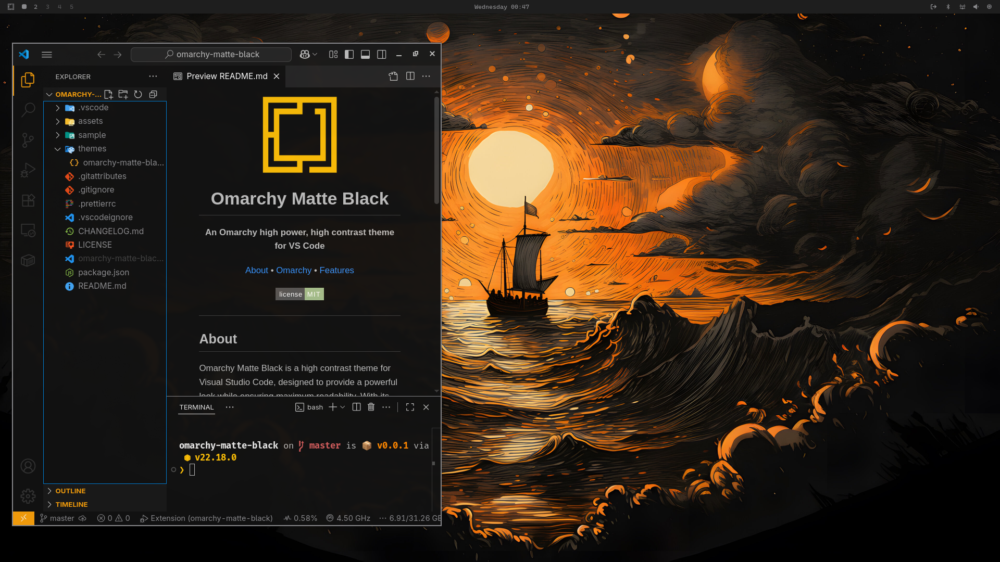

  

<h1 align="center">Omarchy Matte Black</h1>

  <b>An Omarchy high power, high contrast theme for VS Code </b>

  <a href="#about">About</a> • <a href="https://omarchy.org/">Omarchy</a> • <a href="#features">Features</a>

  

---

  

## About

Inspired by https://github.com/tahayvr/matteblack.nvim

Omarchy Matte Black is a high contrast theme for Visual Studio Code, designed to provide a powerful look while ensuring maximum readability. With its dark, matte black background and vibrant syntax highlighting, this theme is perfect for developers who want to reduce eye strain during long coding sessions.

## Features

- **High Contrast**: Designed for maximum readability with a dark, matte black background.
- **Vibrant Syntax Highlighting**: Makes your code pop with clear, distinct colors.
- **Optimized for Focus**: Reduces eye strain during long coding sessions.

---

  <i>Happy coding!</i>

